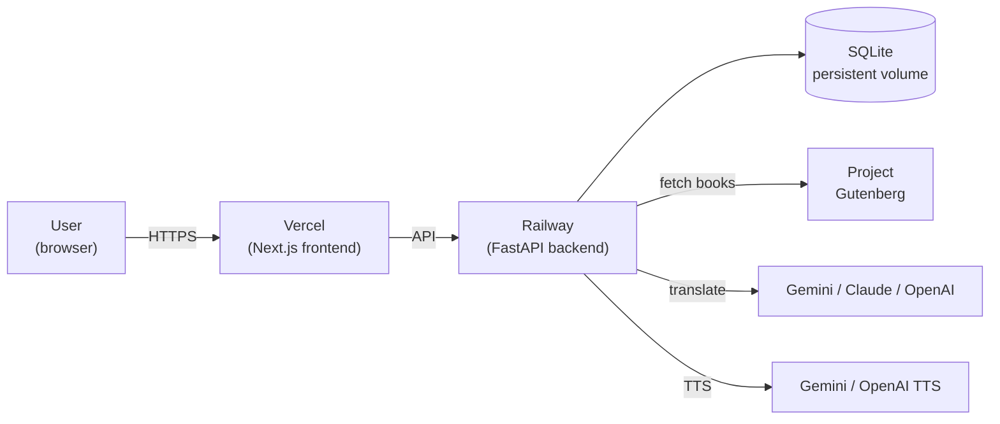

# Stack overview

Book Reader AI is a conventional three-tier app tuned for reading long-form books:

## Backend

- **FastAPI** on Python 3.11. Async throughout.
- **aiosqlite** for the persistence layer. Global monkey-patch enforces `PRAGMA foreign_keys = ON` on every connection (#700, #751).
- **Versioned migrations** at `backend/migrations/NNN_<name>.sql`, applied in order on boot by `services/migrations.run()`.
- **Services layer** (`backend/services/`) contains the business logic: `book_chapters`, `translation_queue`, `gutenberg`, `gemini`, `claude`, `openai`, `tts`, `rate_limiter`, etc.
- **Routers layer** (`backend/routers/`) wraps services in FastAPI endpoints. One router per domain.
- **Test stack**: pytest + pytest-asyncio. No real external calls — Anthropic / Gemini / Google / Gutenberg are mocked.

See [API overview](../reference/api.md) for the router inventory.

## Frontend

- **Next.js 14** (app router) on TypeScript.
- **Tailwind** + a parchment/amber token system. See [Graphic design rules](../development/design-rules.md).
- **NextAuth.js** handles OAuth (Google / GitHub / Apple); the backend issues a separate app JWT after the OAuth step completes.
- **Test stack**: Jest + React Testing Library for unit tests; Playwright for E2E.

## Storage

- **SQLite** on a persistent Railway volume (`DB_PATH` env var points at `/app/data/books.db` in production).
- **WAL journaling** enabled at `init_db` time.
- **EPUB blobs** live in the `book_epubs` table (BLOB column). Separate from the chapter-level caches so reads don't carry megabytes of payload.
- **Audio cache** keyed by `(book_id, chapter_index, chunk_index, provider, voice)`. One row per TTS chunk (BLOB).

## Deploy

- **Backend** — Railway (Dockerfile in `backend/`). Deploys on push to `main`.
- **Frontend** — Vercel (root deployment config). Deploys on push to `main`.
- **Docs site** — GitHub Pages (`.github/workflows/docs.yml`, see [docs site design doc](../design/docs-site.md)). Deploys on push to `main` when `docs/` / `mkdocs.yml` / related paths change.

## Key architectural decisions

- **EPUB-first chapter source**: books that have a stored EPUB render from `build_chapters_from_epub`; plain-text regex split is a fallback. Chapter source is visible to the user as a badge in the reader.
- **Per-user data isolation**: annotations, vocabulary, flashcards, insights are all user-scoped. The FK series #754 removes every soft FK to make cascade-deletion bullet-proof.
- **Background translation queue**: a single always-on worker picks up queued chapters and translates them in rate-limit-respecting batches. UI reads cached translations; on-demand translation is a fallback.
- **Feature flags via env vars**: no runtime toggle system; features are on/off at deploy time.

For the "why" behind each of the above, see the [design docs](design-index.md).
